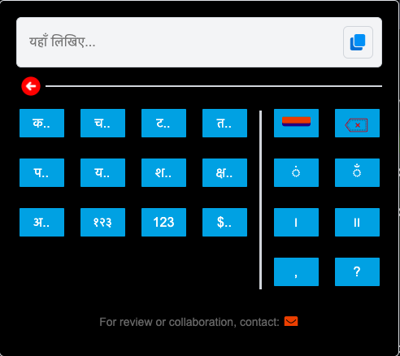

# Hindi-Keyboard-Extension

## Overview

An optimal Hindi Keyboard which takes advantage of unique structure of Devanagari Varnamala.

## Installation

You have two options for installation:

### Option 1: Manual Installation

1. **Download the Extension:**
   - Click [here](https://github.com/x1y2m2/Hindi-Keyboard-Extension/archive/refs/heads/main.zip) to download the extension ZIP file from this GitHub repository.

2. **Unzip the Extension:**
   - Extract the ZIP file to your local computer.

3. **Install in Chrome:**
   - Open Google Chrome.
   - Click on the three-dot menu in the top-right corner.
   - Go to "Extensions."
   - Enable "Developer mode" in the Extensions page.
   - Click "Load unpacked" and select the directory where you extracted the extension.

### Option 2: Command Prompt/Terminal Installation

1. **Open a Terminal/Command Prompt:**
   - Open your terminal or command prompt.

2. **Run the Command:**
   - Use the following command to download the extension:
   ```bash
   # Use curl to download the ZIP archive and unzip it
   curl -LOk https://github.com/x1y2m2/Hindi-Keyboard-Extension/archive/refs/heads/main.zip
   unzip main.zip
   ```

3. **For installation:**
   ```bash
   chrome-cli extensions install /path/to/extension_directory
   ```

##Screencshots


